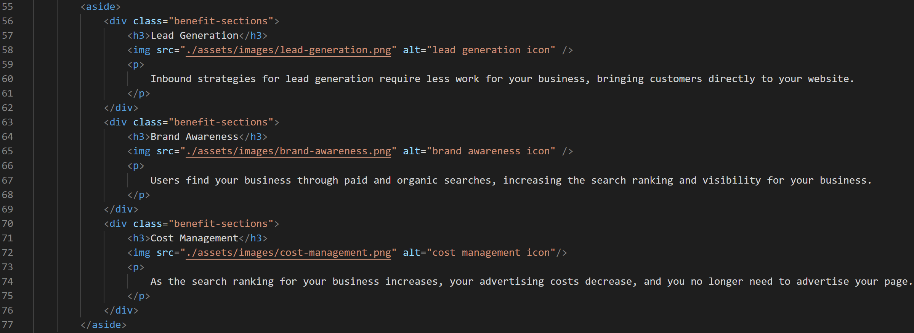

# 01 HTML, CSS, and Git: Code Refractor

## Intro
The appropriate changes have been made to your html and css code which ensure accessibility, optimization, and sustainability standards.

## Changes for Accessibility
1. All image elements have been given alt attributes to assist with any viewers that have disabilities
2. An id tag was added as it was previously missing for "search-engine-optimization" which did not allow for the navigation link to work

## Changes for Optimization
1. The title has been updated to give a quick view of the Horiseon brand
2. HTML class and id attributes have been condensed, removed or changed due to repetition

For example, in the image below, the div tags for the benefit section all have the same class "benefit-sections" (found on lines 56, 63, 70) because they are all styled the same.

3. CSS styles have also been condensed (following the above), so that there is no repetitive code for multiple elements
4. CSS selectors were re-organized to match the proper order coinciding with their respective HTML elements (whole document -> header & nav -> section 1 -> section 2 containing article & aside -> footer)

## Changes for Sustainability
1. Most div tags were removed and semantic HTML elements were added in place
2. Structure was provided to differentiate between elements in the HTML
3. Notes in the CSS code were added to break up the different sections being targeted

## Final Product

[Click here to view your website](https://jessicamdittrich.github.io/CHG-JD051222/)